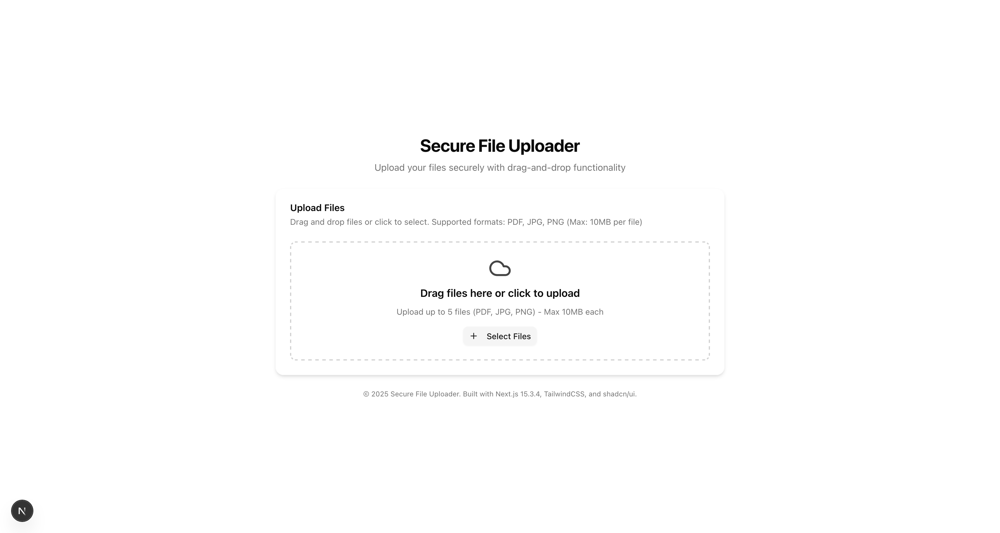

# Secure File Uploader

A secure, modern file upload system built with Next.js 15.3.4, TailwindCSS, and shadcn/ui components. This application provides a robust, production-ready file uploader with drag-and-drop functionality, file validation, and secure upload handling.



## Features

- **Modern UI**: Clean, minimalist dark-themed interface using TailwindCSS and shadcn/ui components
- **Drag-and-Drop Support**: Intuitive drag-and-drop file selection with standard file picker fallback
- **File Preview**: Preview selected files with name, size, and thumbnails for images
- **Upload Progress**: Real-time upload progress tracking for each file
- **Comprehensive Validation**:
  - Client-side file type validation (PDF, JPG, PNG)
  - Client-side file size limits (10MB default, configurable)
  - Server-side validation for added security
- **Security Features**:
  - CSRF protection using double-submit token pattern
  - Secure file handling and storage
  - Input validation and sanitization
- **Responsive Design**: Works flawlessly on desktop, tablet, and mobile devices

## Requirements

- Node.js 18.17.0 or later
- npm or yarn package manager

## Installation

1. Clone the repository or download the code:

```bash
git clone [repository-url]
cd fileupload
```

2. Install dependencies:

```bash
npm install
# or
yarn install
```

3. Copy the environment variables file and adjust settings if needed:

```bash
cp .env.example .env.local
```

4. Create upload directory if it doesn't exist:

```bash
mkdir -p public/uploads
```

## Development

Run the development server:

```bash
npm run dev
# or
yarn dev
```

Open [http://localhost:3000](http://localhost:3000) with your browser to see the application.

### File Structure

```
├── public/               # Public assets and uploaded files
│   └── uploads/          # Where uploaded files are stored
├── src/
│   ├── app/             
│   │   ├── api/          # API routes
│   │   │   └── upload/   # File upload API endpoint
│   │   └── page.tsx      # Main page component
│   ├── components/
│   │   ├── ui/           # shadcn/ui components
│   │   └── file-uploader/# File uploader components
│   │       ├── drop-zone.tsx
│   │       ├── file-list.tsx
│   │       ├── file-uploader.tsx
│   │       └── upload-progress.tsx
│   └── lib/              # Utility functions
│       └── csrf.ts       # CSRF protection utilities
└── .env.local           # Environment variables
```

## Configuration

The application can be configured using environment variables in the `.env.local` file:

- `UPLOAD_DIR`: Directory where uploaded files are stored (default: `public/uploads`)
- `MAX_FILE_SIZE`: Maximum file size in bytes (default: 10MB)

## Production Deployment

1. Build the application:

```bash
npm run build
# or
yarn build
```

2. Start the production server:

```bash
npm start
# or
yarn start
```

### Deployment on Vercel

The easiest way to deploy this Next.js application is using [Vercel](https://vercel.com):

1. Push your code to a Git repository (GitHub, GitLab, or Bitbucket)
2. Import the project in Vercel
3. Configure environment variables if needed
4. Deploy

### Deployment with Docker

Create a Dockerfile in the project root:

```Dockerfile
FROM node:18-alpine
WORKDIR /app
COPY . .
RUN npm install
RUN npm run build
EXPOSE 3000
CMD ["npm", "start"]
```

Build and run the Docker container:

```bash
docker build -t secure-file-uploader .
docker run -p 3000:3000 secure-file-uploader
```

## Security Considerations

- **CSRF Protection**: The application uses a double-submit token pattern to protect against CSRF attacks
- **File Validation**: All files are validated both client-side and server-side for type and size
- **File Storage**: Files are stored with unique UUIDs to prevent filename collisions

## License

MIT
